# School District Analysis
## Overview
* The purpose of this anaylsis was to remove the math and reading scores for 9th graders from Thomas High School due to suspected cheating. 
* After updating the test score the summaries were run again to see how the performance numbers changed.
## Results
* District Summary
  - When comparing the updated district summary to the original summary there is not much change at all. 
  - The percentage of students passing all dropped by 1%
  - The average reading score stayed the same, the average math score dropped by 0.1%
  - Original District Summary
   
   
   - Updated District Summary
   
   
* School Summary
  - Adjusting Thomas High School's 9th grade scores only had an affect on their statistics within the school summary. The other schools were left unchanged
  - The removal of the 9th graders test score lead to:
    - Percent of students that passed math fell from 93.27% to 66.91%
    - Percent of students that passed reading fell from 97.31% to 69.66%
    - Percent of students that passed both tests fell from 90.95% to 65.08% 
    
  - Original Thomas High Summary
  
  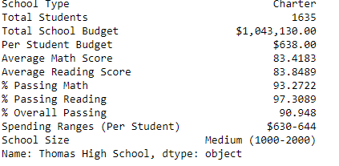
  
  - Updated Thomas High Summary
  
  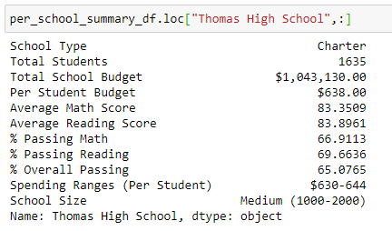
  
* Replacing the scores led to Thomas High School falling out of the top 5 schools. This led to Wright High School being bumped up to the 5th overall school.
* When looking at the scores by grade the scores for Thomas High School 9th graders was replaced with "nan"

 - Original Math and Reading Scores
 
 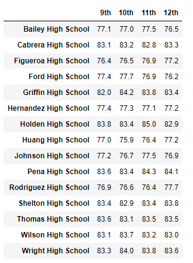 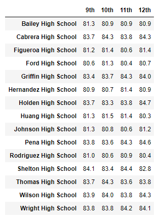
 
 - Redone Math and Reading Scores
  
 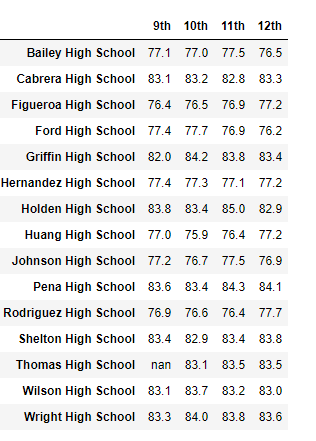 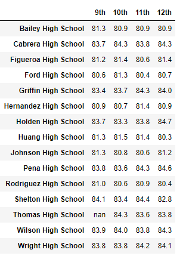
 
 * The removal of the scores dropped the percentage of students who passed in the $630 to $644 grouping by 6% to 7%.
 
 - Original Scores By Spending
 
 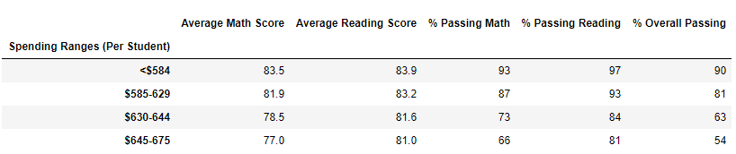
 
 - Redone Scores By Spending
 
 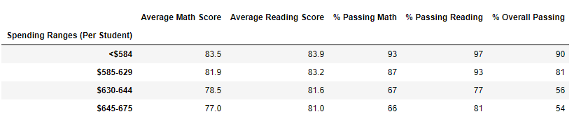
 
 * The medium sized school group percentages dropped by 6% due to the removal of the scores
 
 - Original Scores By Size
 
 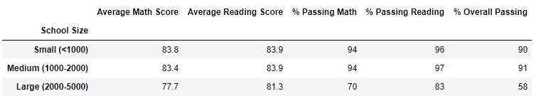
 
 - Redone Scores By Size
 
 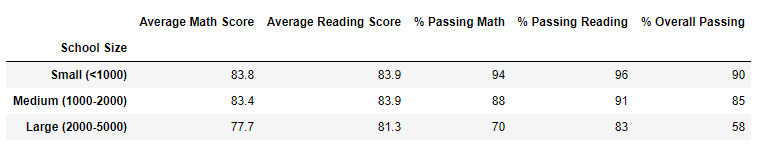
 
 * The charter school passing percentage dropped as well
 
 - Original Scores By School Type
 
 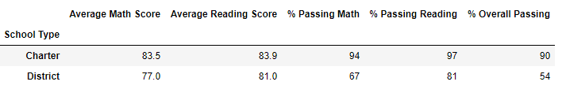
 
 - Redone Scores By School Type
 
 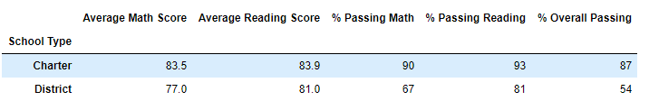
 
 ## Summary
 * The removal of the score did not have a drastic change on the percentages when looking at the school district overall
 * Thomas High School's overall percentage of students who passed along with percentage of students who passed math and reading, drastibally dropped.
 * The editing of the data only changed the $630 to $644 group, which Thomas High School was in.
 * The medium size school classification dropped by 6% while the small and large stayed the same.
 
