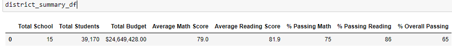
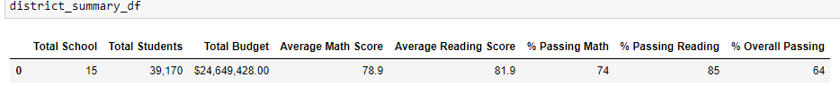

# School District Analysis
## Overview
* The purpose of this anaylsis was to remove the math and reading scores for 9th graders from Thomas High School due to suspected cheating. 
* After updating the test score the summaries were run again to see how the performance numbers changed.
## Results
* District Summary
  - When comparing the updated district summary to the original summary there is not much change at all. 
  - The percentage of students passing all dropped by 1%
  - The average reading score stayed the same, the average math score dropped by 0.1%
  - Original District Summary
   
   
   - Updated District Summary
   
   
* School Summary
  - 
* how does replacing 9th grader scores at Thomas affect their performance compared to other schools?
* how does replacing 9th grade scores affect
  - math and reading scores by grade
  - scores by school spending
  - scores by school size
  - scores by school type
